# Audio Edit & Tag

Browse, audition, tag, edit and mangle a large audio library without moving or
renaming a single audio file. Tags and edits are sidecar data; **the original
audio is never written to**. Audio reaches disk only when you explicitly export,
and export writes a new file.

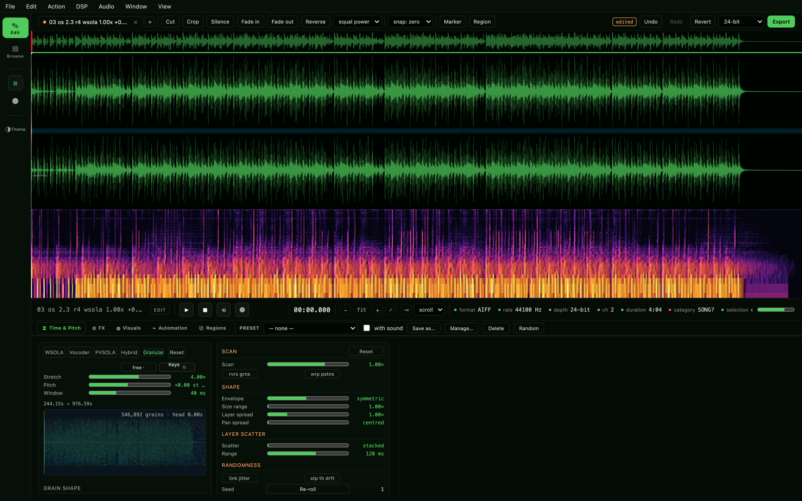

## Start here

| | |
|---|---|
| **macOS** | double-click **`Start.command`** |
| **Windows** | double-click **`StartHere.bat`** |

Either one starts a small local server and opens your browser at
`http://127.0.0.1:8737/`. Nothing else needs installing — no Python, no runtime,
no Node. Close the window or press Ctrl-C to stop it.

On the first run it opens on the bundled `Audio Library` folder. After that it
remembers whichever library you pick, and you can change it any time from the
Library tab.

## What it does

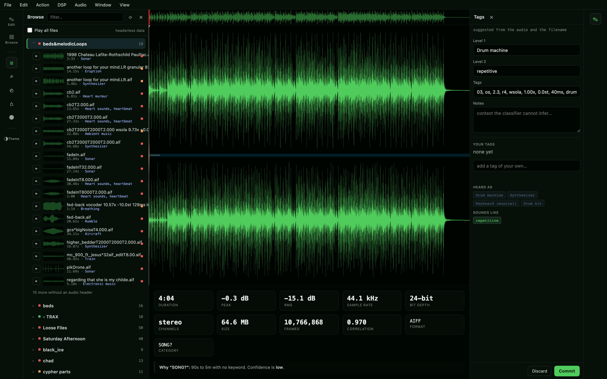

| | |
|---|---|
| **Browse** | The whole library as a tree, classified and searchable. Clicking a sound **auditions the sound itself** — no edits, no stretch, no effects, whatever has been done to it elsewhere |
| **Tag** | Three separate systems, deliberately not mixed: what it *is*, what it is *like*, and what *you* call it |
| **Edit** | A non-destructive clip list — cut, crop, duplicate, fade, reverse, insert silence — with snap to zero crossings so edits do not click |
| **Stretch** | Five engines, **all five running live in the audio callback**, answering one shared set of controls |
| **Shape** | Nine effects that run under your fingers while the sound plays, rather than being applied and waited for |
| **Watch** | Ten grain visualisers drawn from the same schedule the renderer is working through |
| **Theme** | Twenty palettes, each deriving the whole interface from a handful of colours. Waveforms stay green or blue in every one of them |
| **Export** | AIFF beside the original, named for what was done to it, with every setting written inside the file |

## The stack

Everything below the interface is Rust, in one workspace that builds to one
binary. The interface is plain HTML, CSS and JavaScript with no build step and
no bundler, embedded into that binary at compile time.

It reaches the internet at no point. p5.js and both fonts are served from the
binary rather than from a CDN, so the grain visualiser works offline like
everything else does.

<table>
<tr><th align="left">Layer</th><th align="left">Built with</th></tr>
<tr><td>Core</td><td>

</td></tr>
<tr><td>Audio out</td><td>

</td></tr>
<tr><td>Audio formats</td><td>

</td></tr>
<tr><td>Machine listening</td><td>

</td></tr>
<tr><td>Interface</td><td>

</td></tr>
<tr><td>Visualisers</td><td>

</td></tr>
<tr><td>Storage</td><td>

</td></tr>
</table>

**Two external crates, on purpose.** `cpal` for the audio device and
`tract-onnx` for the classifier — 136 crates in the tree once their own
dependencies are counted. Everything else is written here: the HTTP/1.1 server
on `std::net`, the JSON parser, the FFT, every filter and stretcher, the AIFF
writer, the TSV store. Both dependencies are pure Rust, which is what keeps the
Windows cross-build a single command with nothing but a linker installed. That
is the test for a third: not "is it a dependency" but "does it break the
cross-build".

### The workspace

| Crate | Lines | Tests | What it is |
|---|---:|---:|---|
| `audio-core` | 2928 | 86 | Container probe and decode (WAV, AIFF, AIFC, headerless PCM), **AIFF writer**, peak tiles, FFT, spectrogram, statistics, WAV writer |
| `catalog` | 1103 | 26 | The classification taxonomy — categories, machines, instruments, confidence |
| `indexer` | 785 | 20 | Library walk, classify, write the TSV index |
| `fx` | 18870 | 319 | RBJ biquads, parametric EQ, compressor, channel maximiser, **five stretchers**, **34 shapers**, the parameter layer, and the sines/transients/noise separation |
| `edit` | 4195 | 126 | Non-destructive edit list, **zero-crossing snap**, **measurement** (peak, RMS, silence, clicks), windowed render, WAV and AIFF export, **the looped export and its tail** |
| `engine` | 5148 | 72 | Real-time block renderer, all five streaming engines, transport, cpal device |
| `search` | 1059 | 20 | Acoustic fingerprints, similarity ranking, learned tags |
| `yamnet` | 1453 | 51 | ONNX inference, band-limited resampling, label policy |
| `server` | 13864 | 245 | HTTP/1.1 on `std::net`, a thread per connection, 47 API routes, JSON, persistence, **marker and region commands**, the live bridge to the audio thread |
| `audiolab` | 67 | — | The binary |
| | **49472** | **965** | |

Plus **24 browser tests** across five spec files, which run under Playwright
rather than `cargo test`. Counts re-measured 17 Aug 2026.

## Time stretching

Five engines, **all five running in the audio callback** — the picker changes
what you hear, not only what you export. They are not a quality ladder; they
fail in different directions, so the choice is about the material.

| | Domain | Good at | Bad at |
|---|---|---|---|
| **WSOLA** | Time | Transients, percussion, one-shots | Dense polyphony smears |
| **Phase vocoder** | Frequency | Chords, sustained tone, pads | Transients smear, noise goes watery |
| **PVSOLA** | Both | Sustained pitched material, long ratios | Small splice artefacts; ~2.5× the vocoder's cost |
| **Hybrid** | Both | Anything mixed, and any ratio at all | The slow one — roughly 5× the vocoder |
| **Granular** | Time | Extreme ratios, texture | Not trying to be transparent |

The last two are built out of the first three rather than beside them.
**PVSOLA** runs the vocoder for a handful of frames at a time and then stops
trusting the propagated phase, re-anchoring to the waveform with a WSOLA
splice — so the drift that makes a long vocoder stretch sound hollow never gets
time to accumulate.

**Hybrid** separates the sound into steady partials, attacks and everything
else, and gives each the method that suits it: the vocoder for the partials,
WSOLA for the attacks, and for the residual, *noise morphing* — the spectral
envelope of the original noise imposed on freshly generated noise, so a
one-second breath becomes ten seconds of breath rather than ten copies of one.
It is the only engine here that will not repeat itself at long ratios, and the
only one with a level for each of the three parts, so a sound's air can be
turned down without touching its tone.

**What you hear is what you export.** The offline renderers are loops over the
same streaming engines the callback drives — one implementation, not two kept in
step — and that is asserted to 1e-6 rather than claimed.

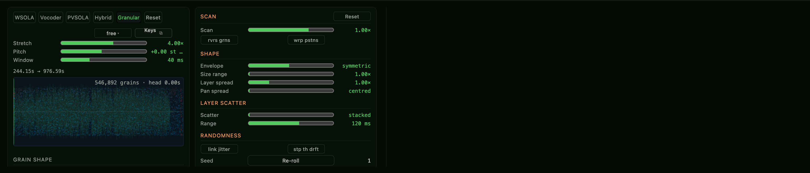

*The granular engine's controls. Every engine gets the same set — see below.*

### One control set, every engine

These drive **all five**. They were never granular ideas: every engine lays
something down repeatedly, so every one has a rate, a length, a place it reads
from and a speed it reads at. A window is a splice for WSOLA and an analysis
frame for the vocoder.

| Control | Range | What it does |
|---|---|---|
| **Stretch** | 0.01–100× | How much longer the result is than the source. Logarithmic |
| **Pitch** | ±48 st | Shifts pitch without changing length — the engine runs at ratio × pitch and the result is read back that much faster |
| **Window** | 5–2000 ms | The length of one piece the engine works with. Short follows transients; long holds tone together |

**Grain shape**

| Control | Range | What it does |
|---|---|---|
| Density | 0–500/s | How often a window is laid down. `auto` derives it from the window and Overlap |
| Layers | 1–16 | How many copies of the engine run at once, each reading its own place. Level compensated by √N |
| Overlap | 1–8× | How many windows cover any one moment, while Density is on `auto` |
| Size jitter | 0–100% | How much each window's length varies |
| Position jitter | 0–500 ms | How far each window may be thrown from where it should read |

**Pitch movement**

| Control | Range | What it does |
|---|---|---|
| Pitch jitter | 0–24 st | A fresh random shift per grain |
| Pitch drift | 0–24 st | A slow wander shared by the whole cloud |
| Drift rate | 0.01–10 Hz | How fast that wander moves |

**Extended — also every engine**

| Group | Controls |
|---|---|
| **Scan** | Scan −2…2× (1× is a normal stretch, 0 freezes on one instant, negative runs backwards), reverse grains, wrap positions |
| **Shape** | Envelope (percussive ↔ symmetric ↔ swelling), Size range 1–8×, Layer spread 0–4×, Pan spread 0–100% |
| **Layer scatter** | Scatter 0–100%, Range 1–2000 ms — throws each layer's read pointer somewhere else so the layers are a cloud rather than a comb |
| **Randomness** | link jitter, step the drift, Seed with re-roll |

**Layers are a cloud, not a comb.** Every layer used to read the same instant
and be laid down a fixed fraction of a hop later — a delay line, and regular
delays make regular notches. Sixteen layers took the spectrum's ripple from
7.8 dB to 11.9 dB and made the sound *thinner*. Scatter and Range fix that;
after, sixteen layers sit at or below the ripple of one.

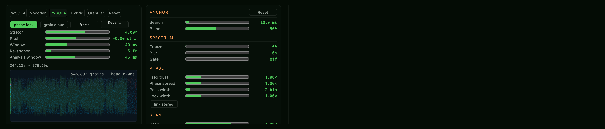

*PVSOLA, with its own three controls on the right of the same table.*

### What each engine adds

Every extended control is a constant the algorithm was tuned around, exposed on
purpose. They are there to break it.

**WSOLA** — preserve transients, Detector 0–100%

| Group | Controls |
|---|---|
| Splice | Search 0–200 ms (0 is plain overlap-add), Pick `best`/`worst`/`loud`, Window `hann`/`tri`/`rect`, Stride 1–128 fr |
| Transients | Floor 0–2×, Guard 1–16 hops |

**Phase vocoder** — Analysis window 5–500 ms, phase lock

| Group | Controls |
|---|---|
| Spectrum | Freeze 0–100%, Blur 0–100%, Gate 0–100% |
| Phase | Freq trust 0–4×, Phase spread 0–4×, Peak width 1–16 bins, Lock width 0–4×, link stereo |

**PVSOLA** — Re-anchor 1–64 frames

| Group | Controls |
|---|---|
| Anchor | Search 0–200 ms, Blend 0–100% |
| *plus* | The vocoder's whole set — between anchors this engine **is** the vocoder |

WSOLA's splice controls are deliberately **absent** here: PVSOLA finds its
splice with its own search, so showing them would be decoration.

**Hybrid** — Tone / Hits / Air, each 0–2×, and remake noise

| Group | Controls |
|---|---|
| Separation | Hold 3–101 fr, Spread 3–101 bins, Margin 1–8×, Resolution 256–8192 |
| *plus* | The vocoder's set (shaping the tone) **and** WSOLA's (shaping the hits) |

The transient detector has no switch here because the hybrid holds it on: an
attack surviving at its own rate is the whole reason that part was separated.

**Granular** — the shared set above is the whole of it.

Every control in the tray carries an explanation on hover, and
`fx/tests/routing.rs` pins the entire table in both directions: everything a
panel shows moves the audio, and what a panel does not show provably does not.

### Where it comes from

Built from the papers in `Reference Docs/`, chiefly Driedger's *Time-Scale
Modification Algorithms for Music Audio* — the phase propagation follows
equations 5.10 to 5.12 and the code is laid out to be read against it. The
separation is Fitzgerald's median filtering with Driedger's HPR-M masks; PVSOLA
is Moinet and Dutoit (DAFx-12); the noise morphing is Moliner, Lehtonen and
Välimäki (2023).

## Playing it from the keyboard

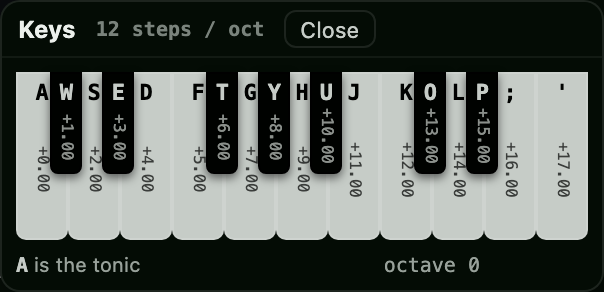

**Window ▸ Keys**, or the button on the stretch row. The home row is the white
notes from C and the row above holds the black ones — which is why a QWERTY
keyboard fits a piano at all, and why the offsets land where a player expects.
`Z` and `X` shift an octave down and up, and they latch, so repeated presses
keep going.

It plays the **pitch control**, not a sampler: the note is a semitone offset
into whatever engine and stretch are already set up, so a four-minute drone
becomes something you can play a line on. And it binds to the tuning that is
selected — at 12 steps to the octave the keys are semitones, and under any other
tuning they are that tuning's degrees, so the black keys stop being black keys
and start being wherever that scale's steps fall.

## Live shaping

Peak's DSP menu is a list of things you apply to a selection and wait for. Most
of them have no reason to work that way, so they are rack effects here and run
under your fingers while the sound plays.

| | Controls |
|---|---|
| **Invert** | — polarity |
| **Swap** | — channels |
| **Width** | Width 0–2× |
| **DC** | Below 1–60 Hz |
| **Ring mod** | Frequency 0.1–8000 Hz, Mix, Sweep ±2000 Hz/s |
| **Rappify** | Amount, Centre 60–6000 Hz, Speed 1–200 Hz |
| **Boomerang** | Throw 20–2000 ms, Mix |
| **Amp fit** | Grain 5–500 ms, Amount, Floor −80…−20 dB |
| **Gate** | Threshold −80…0 dB, Attack, Release, Depth |

Built from the reference documents rather than the names, which mattered:
**Rappify** turned out to be extreme *dynamic filtering*, not distortion, and
**Amp fit** is per-grain normalisation, not compression. Two are better live
than they ever were offline — *Boomerang* offline needs to know where the
selection ends, but live it is a rolling buffer read backwards, so the reversal
chases the playhead and the throw length becomes a control it never had.

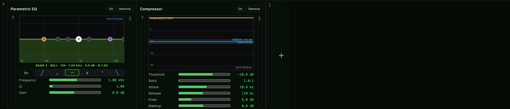

The interface draws every one of them from `/api/fx`; nothing in the JavaScript
knows what any shaper does. An effect gains a control by declaring one in
`fx::shape` and neither the rack nor the interface is touched.

## Editing

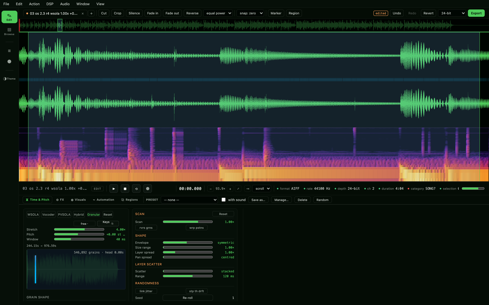

*Zoomed in: the grain schedule drawn on the sound it reads from, the selection,
and the spectrogram sharing the lane.*

A clip list, never a rewrite. Cutting an hour out of a recording costs two
integers.

| | |
|---|---|
| **Snap** | Zero crossings, CD frames (588), PS2 (28), Xbox (64), or off. **On by default** — a cut that does not start and end at the centre line is a click. Crossings are looked for per channel, because two channels in opposite phase sum to nothing at all |
| **Edit** | Cut, Crop, Silence, Insert silence, Duplicate, Fade in/out (linear or equal power), Reverse, Undo/Redo/Revert |
| **Select** | Set selection numerically, Select all, Fit selection, Zoom at sample level, Go to |
| **Markers** | New marker, New region, New region split, Markers to regions, Nudge, Rename (with `#` numbering), Delete markers in selection |
| **Measure** | Normalize, Normalize (RMS), Find peak, Strip silence, Repair click |

Peak's own worked examples are the tests: three markers named "Foo 1/2/3"
become **two** regions; `Event #000` starting at 10 gives `Event 010`,
`Event 011`.

Edits address the **pre-stretch** timeline — cutting a second removes a second
of source, whatever the ratio is doing to the output length.

## Export

**AIFF, beside the original, named for what was done to it, with the settings
inside.**

    aahh pvsola 2.50x -7.0st 60ms.aiff

The engine and the three settings that decide what you hear go in the name, so
a folder of exports is readable without opening any of it. Always all four,
even at their defaults — a name that omits what is inert cannot be predicted,
sorted or grepped. A name already taken gets ` 2`.

**The file is its own preset.** An `APPL` chunk behind the signature `AuLb`
carries the whole document's settings — every engine, every extended control,
the grain cloud and the rack — with a `NAME` and a line of `ANNO` so anything
else that opens it sees why the sound is the length it is. A `FORM` is a list
of chunks and readers must skip what they do not know, which is what makes this
safe in files the library will re-index. 16- and 24-bit are AIFF; 32-bit float
is AIFC.

Reading those settings back in is **not built yet** — but every file written
carries them, so nothing exported now will need exporting again for it.

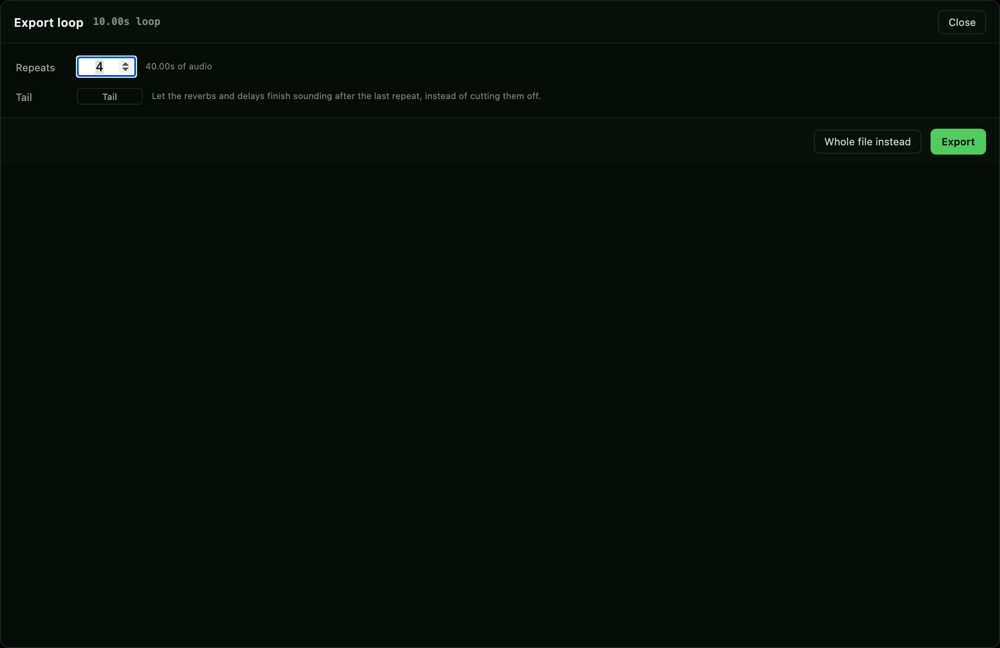

### Exporting a loop

If the transport loop is on, Export asks two questions instead of none: **how
many repeats**, and **whether to keep the tail**. Loop off is the export it
always was, and opens nothing.

The loop range is the transport's own rule — the selection if there is one, the
whole document if there is not. The seam matches the engine exactly, a quarter
of the loop capped at 512 frames, faded out and back in through zero rather
than overlapped, so **every repeat is exactly the selection's length** and the
file sounds like what you auditioned.

The **rack runs once, continuously, over the whole tiled stream**. That is the
point of it: rendering the loop wet and then repeating it would give every
repeat its own severed reverb tail, chopped at the seam and restarted. This way
the reverb and the delay bleed across each repeat as they do when it loops.

**The tail** is that same rack fed silence until it stops speaking — cut at the
last frame above −80 dBFS, plus 50 ms so the file ends in silence. A rack with
nothing in it that can ring gets no tail at all. Capped at 30 seconds, because
reverb `freeze` is unbounded by construction and a render has to end.

### Watching it

An export of a four-minute file takes twenty-five seconds; a heavy stretch takes
minutes. It runs on a thread of its own and reports as it goes — a bar under the
toolbar naming the phase, and a **Stop** that discards the part-written file.

The tick reaches inside `Stretch::process`, which is the part that actually
takes the time. A bar fed only by the write loop would sit at zero for the whole
wait and then jump to full. Progress is counted in *work* frames rather than
output frames, because `layered` runs the whole engine once per layer.

See [`docs/EXPORT-LOOP.md`](docs/EXPORT-LOOP.md).

## Tagging

Three systems, kept apart on purpose. Conflating them is what made the old tags
useless.

| | Says | Where it comes from |
|---|---|---|
| **Heard as** | what it *is* | YAMNet — AudioSet's 521 nouns, ONNX inference on device |
| **Sounds like** | what it is *like* | Acoustic fingerprints — length, loudness, brightness, noisiness, attack |
| **Your tags** | what *you* call it | Learned by example from the ones you apply |

Thresholds are measured and different on purpose: a label that applies itself
needs a stricter bar than one merely offered. There is very little daylight —
five snares sit 0.85–0.91 of each other and the first *unrelated* sound is at
0.838. Your own tags never mix into the suggested field, or the system learns
from itself.

## Watching the grains

| | |
|---|---|
| 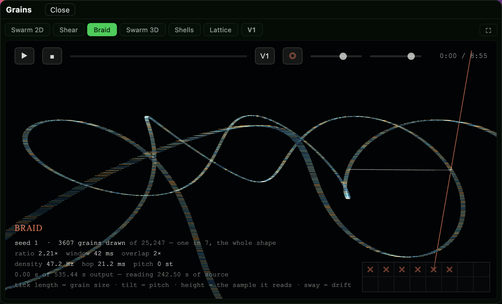 | 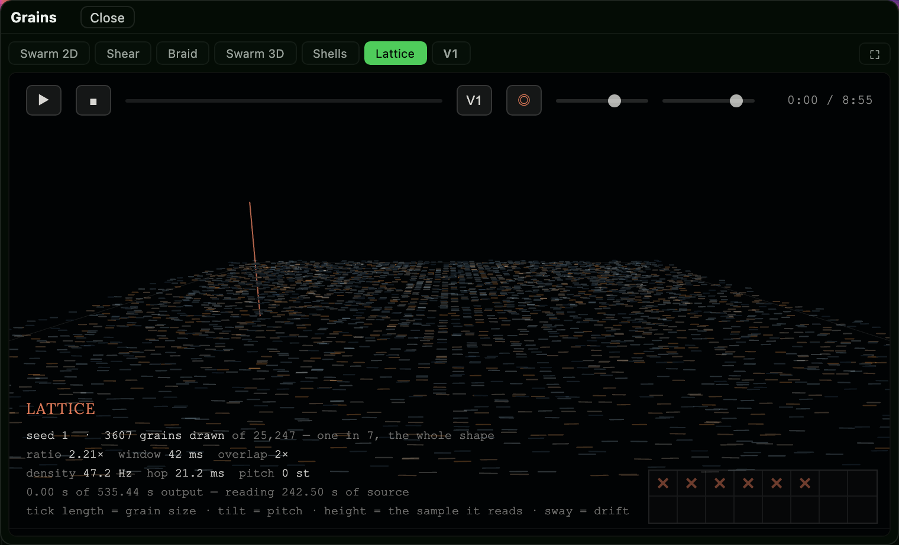 |
| **Braid** — time wound into a helix; the strands are the overlap | **Lattice** — the hop grid as a crystal, melted by the jitters |

Ten views in two suites, at `/grains3d` — standalone, in a pop-over, or through
**Window ▸ Grains**.

They used to take half the stretch tray and redraw beside the controls whether
or not you were looking at them. They are a window now, closed by default, so
they cost nothing until opened. The 2D swarm, the picker and the 3D frame are
the same elements moved into it, not copies. They are **not a decoration over the audio**: the picture is drawn from
`fx::grain::grains()`, the same schedule the renderer is working through, with
`rand01` ported to JavaScript as a BigInt splitmix64 that matches the Rust
exactly. A grain you see is a grain you hear.

| Suite | Views | Idea |
|---|---|---|
| **The object** | Shear · Braid · Swarm · Shells · Lattice | The whole stretch as a shape you can look around. The ratio is not a number here — it is the slope |
| **The moment** | Tunnel · Mandala · Rorschach · Vortex · Ripple | Centred on *now*, mirrored, with time moving past a fixed camera |

Each view has a factory look of its own — speed, glow, orbit, trail, colour-by,
mirrors, palette — and sixteen slots to store your own. Look and slots go to
`localStorage` because decisions should outlive the window; the camera goes to
`sessionStorage`, because an empty store *is* the signal that this is the
session's first look, which is what makes every view open zoomed in on the
playhead.

## Themes

Twenty-one, from **Theme** in the left rail. They come in two kinds.

At the top of that panel, above the palettes, is **the waveform's own colour** —
Blue, Green, Red, Purple, or any colour you like from a swatch. All four are
neon by construction: the chroma is past what sRGB can show, so it clamps to the
edge of the gamut. Measured off the pixels: `rgb(0,159,255)`, `rgb(0,239,42)`,
`rgb(255,0,0)`, `rgb(185,0,255)`.

It is deliberately **not** part of the palette engine. A theme derives sixty
tokens so the chrome holds contrast; the waveform is not chrome — it is the
thing being looked at, and it should be the loudest colour on screen rather than
a consequence of the surfaces behind it. `Theme.apply` only clears tokens in its
own map, so `--wave` survives every palette change and every "No theme".

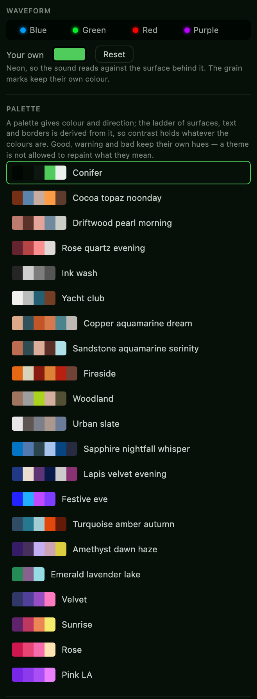

**Derived** — twenty palettes ported from Emovis, each giving four to six
colours from which the engine works out a hundred-odd tokens. That is the right
trade for a palette nobody designed for this program: the surface ladder and the
text steps are ours, and only the colour is theirs.

**Direct** — a theme that states its tokens outright, with no derivation in
between. There is one, **Conifer**: the interface's own colours with the hue
moved from blue to green and the deep end pushed deeper. Its lightness ladder is
held to within half a percent of the original at every step, so the contrast
structure the panels were designed against is unchanged and only the colour
moves.

A direct theme states only what it means to change. Everything it leaves out —
the status colours, every hairline and shadow, both waveform colours — falls
back to the stylesheet, which is why `--good`, `--warn` and `--bad` keep their
meaning under it.

Three decisions worth knowing, because each looks like a bug otherwise:

- **Waveforms are always green or blue**, in the browser, in the editor and in
  every panel, whatever the theme is doing. Audio is the thing you are reading;
  it does not get restyled. `--wave` and `--wave-2` sit deliberately outside the
  theme, as do the status colours.
- **The library holds 48 and the picker offers 21.** The chrome reads depth as
  lightness — a raised surface is a lighter one — which is a dark-theme
  assumption in every panel. All 27 light palettes break that ladder and all 20
  dark ones hold it, so the light ones are withheld rather than shown broken.
- **Conifer's two deepest steps are at the sRGB floor.** At that lightness the
  gamut has no room for colour: raising chroma from 0.020 to 0.060 moves the
  value by a single bit. The deepest black is green by construction rather than
  visibly, and the green becomes plain from `--surface` upward.

## Testing

    cargo test --release --manifest-path core/Cargo.toml     # 965
    npm run check                                            # the interface, statically
    npm run test:ui                                          # the interface, in a browser  # 24

The Rust tests are the bulk of it and need nothing installed. The other two are
development tooling — `package.json` exists for them alone; the application is
the binary and has no Node in it anywhere.

| | |
|---|---|
| `tools/ui-check.mjs` | Reads `ui/` and finds what does not resolve — a control with no default, a pane with no entry in the map, a function nothing calls. It found two dead functions on its first run, one of which had quietly removed the channel maximiser from the product for three days. Runs under `cargo test` too, via `server/tests/interface.rs` |
| `tools/scratch-server.mjs` | A throwaway instance on a port of its own with a library of its own, so nothing here can touch a working session. `--check` runs 13 API checks |
| `tools/screenshots.mjs` | Takes the pictures in this file, from the running program. `node tools/screenshots.mjs` — so when the interface changes they are one command from being right again, rather than quietly three versions stale |
| `tests/ui/*.spec.mjs` | Playwright, against that scratch server. The only thing that catches a panel which builds without error and shows nothing — which has happened, more than once |

The last one exists because static analysis cannot see a panel that is present,
correct and zero pixels tall.

### On every push

`.github/workflows/ci.yml` builds the workspace, runs all 965 Rust tests, then
drives the binary it just built through the 24 browser tests. One job, because
the browser tests need that exact binary — the interface is `include_str!`-
embedded, so a second build would be a second interface.

It earned itself on its first two runs, both times by being a machine this had
never run on:

- **A Linux box.** `cargo test` had only ever run on macOS.
- **A box with no sound card.** `/api/engine/state` opened the audio device, so
  it answered 503 — and the interface polls it constantly. The test for that had
  been written correctly months earlier and *could not fail anywhere it had ever
  been run*. See [`docs/NO-AUDIO-DEVICE.md`](docs/NO-AUDIO-DEVICE.md).

`tests/ui/globals.spec.mjs` is the other lesson from the same week: `ui/*.js`
are classic scripts sharing one global scope, so a name declared twice silently
replaces the other, and the thing that breaks is in whichever file lost —
somewhere else entirely. It is checked by name because it cannot be caught by
behaviour.

## Documentation

| | |
|---|---|
| [`docs/STATE.md`](docs/STATE.md) | **Start here if you are picking this up.** The whole project state in one file — how it works, what is decided, what is open, and every trap that has cost time |
| [`docs/ARCHITECTURE.md`](docs/ARCHITECTURE.md) | How it is built, as built — the crates, the edit model, the DSP, the real-time layers, the server, what it stores |
| [`docs/CONTROLS.md`](docs/CONTROLS.md) | Every control: click, drag, alt-drag, double-click, right-click, press-and-hold, wheel, keyboard |
| [`docs/MENUS.md`](docs/MENUS.md) | Every menu item, what it needs to be available, and what it does |
| [`docs/ROADMAP.md`](docs/ROADMAP.md) | Where this is going — a sellable product, then VST and AU, and what each step costs |
| [`docs/LICENSING-POLICY.md`](docs/LICENSING-POLICY.md) | What may and may not be read or linked, and why provenance matters once something is for sale |
| [`docs/THIRD-PARTY.md`](docs/THIRD-PARTY.md) | Every dependency, its licence, and what it would take to remove it |
| [`docs/LIVE-STATE-AUDIT.md`](docs/LIVE-STATE-AUDIT.md) | Every place a value change used to rebuild the object holding the state — the reverb-tail bug and its siblings |
| [`docs/TEST-COVERAGE-AUDIT.md`](docs/TEST-COVERAGE-AUDIT.md) | What is tested, what is not, and which invariants no test has yet named |
| [`docs/CI.md`](docs/CI.md) | What runs on every push, what it costs, and the two bugs it found on its first two runs |
| [`docs/NO-AUDIO-DEVICE.md`](docs/NO-AUDIO-DEVICE.md) | What works without a sound card, what does not, and why no test caught it for months |
| [`docs/EXPORT-LOOP.md`](docs/EXPORT-LOOP.md) | Exporting the loop with repeats and a tail, and watching an export run |
| [`visualiser/PRECOMPUTED-WEATHER.md`](visualiser/PRECOMPUTED-WEATHER.md) | The aesthetic argument behind the ten grain views |
| [`Reference Docs/md/STRETCH-ROADMAP.md`](Reference%20Docs/md/STRETCH-ROADMAP.md) | The stretching theories, which are implemented, and what is next |
| [`Reference Docs/md/`](Reference%20Docs/md/) | Every reference PDF extracted to markdown — the Driedger thesis, the Peak manual chapters. **Read these, not the PDFs** |

## Layout

    Start.command     macOS launcher
    StartHere.bat     Windows launcher
    bin/              built programs, if you have them. Not in git; see below
    data/             everything the app remembers. Not in git; see below
    core/             the Rust workspace
    docs/             state, architecture, controls, menus, roadmap, audits
    ui/               the interface, embedded into the binary at build time
    visualiser/       the p5.js grain views, served at /grains3d
    tools/            development only — the static interface check and the scratch server
    tests/ui/         development only — Playwright specs
    models/           the YAMNet ONNX model
    Audio Library/    sample audio to try it on
    Reference Docs/   papers, the stretch roadmap, and the classification taxonomy

Everything in `ui/` and `visualiser/` is compiled *into* the binary — the
interface, the stylesheet, the theme engine, the palette library, p5.js and both
fonts. `tools/` and `tests/` are not; they never ship.

## The built programs

`bin/` is **not tracked in git**. The classifier took the binaries from 4.7 MB
to 74 MB, and git keeps every version of that forever.

The launchers build from source when `bin/` is empty, so a fresh clone works —
it just takes a minute the first time. If you want them there, put them there:

    cargo build --release --manifest-path core/Cargo.toml
    cp core/target/release/audiolab bin/

Either launcher runs **whichever binary is newer**, the shipped one or your own
build. It used to prefer `bin/` outright, which meant a rebuild could silently
have no effect because the launcher was still running a copy from weeks ago.

## Where your work is kept

Everything the app remembers lives in **`data/`**, beside the launcher — the
chosen library path, tag overrides, markers, presets, saved sessions, acoustic
fingerprints, learned labels and the scan index. It is deliberately *not* under
`core/target`, because `cargo build --release` output gets cleaned and would
take your work with it.

`data/` is not tracked in git; it is per-machine, and the library path differs
between the Mac and the PC.

## Building from source

    cargo build --release --manifest-path core/Cargo.toml     # this machine
    cargo test  --release --manifest-path core/Cargo.toml     # 965 tests

For the Windows build from a Mac, once per machine:

    rustup target add x86_64-pc-windows-gnu
    brew install mingw-w64

then

    cargo build --release --manifest-path core/Cargo.toml --target x86_64-pc-windows-gnu
    cp core/target/x86_64-pc-windows-gnu/release/audiolab.exe bin/

**The interface is embedded into the binary** with `include_str!`. After editing
anything in `ui/` or `visualiser/`, rebuild — otherwise the browser is served
the old file. This has cost more time than anything else in this project.

## Worth knowing

- **Nothing here renames, moves or overwrites audio.** Edits are an edit list —
  clips referencing ranges of the source — so cutting an hour costs two
  integers. Export is the only thing that writes audio, and it writes a new file
  every time, never over an existing one.
- **A sound opens at its defaults.** Settings are not carried over from a
  previous run; presets are the deliberate way to put them back. Work done in
  the current run survives switching tabs and coming back.
- **Auditioning is not playback of a document.** Clicking a file in the library
  plays the file. The editor plays the document, in full.
- **Provenance is shown, not hidden.** Values are marked measured, inferred or
  guessed, because a lot of this library is headerless PCM where the truth has
  to be reconstructed.
- **Anything the probe cannot recognise is read as headerless PCM**, which is
  why a peak cache or a text sidecar will play as noise. That fallback is
  deliberate — SD2 data forks and raw dumps are real sounds with no header — so
  it stays, and **Play all files** in the View menu decides whether the browser
  offers them.
- **Mono vs dual-mono stereo cannot be determined from raw PCM** — both give an
  identical 0.5 delta ratio. Headerless channel counts come from neighbouring
  headered files instead.
- **The waveform is sample accurate when zoomed in.** Past the point where there
  are more pixels than samples, the display stops being a min/max summary and
  draws the samples themselves; the zoom readout switches to `n smp` to say so.
- **Grain randomness is a pure function of grain index and seed**, never a
  running generator — because the waveform, the playback and the exported file
  are three separate renders, and a stateful generator would give each of them
  different audio.
- **The playhead sits on the sound, not on the frame counter.** The counter
  counts frames produced; the device holds a buffer of them before any are
  heard, so the reported output latency is subtracted.
- **The Windows binary is cross-built and verified as a PE32+, but has never
  been run on Windows.**

## Licence

MIT OR Apache-2.0.
