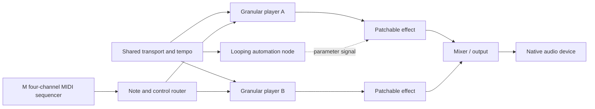
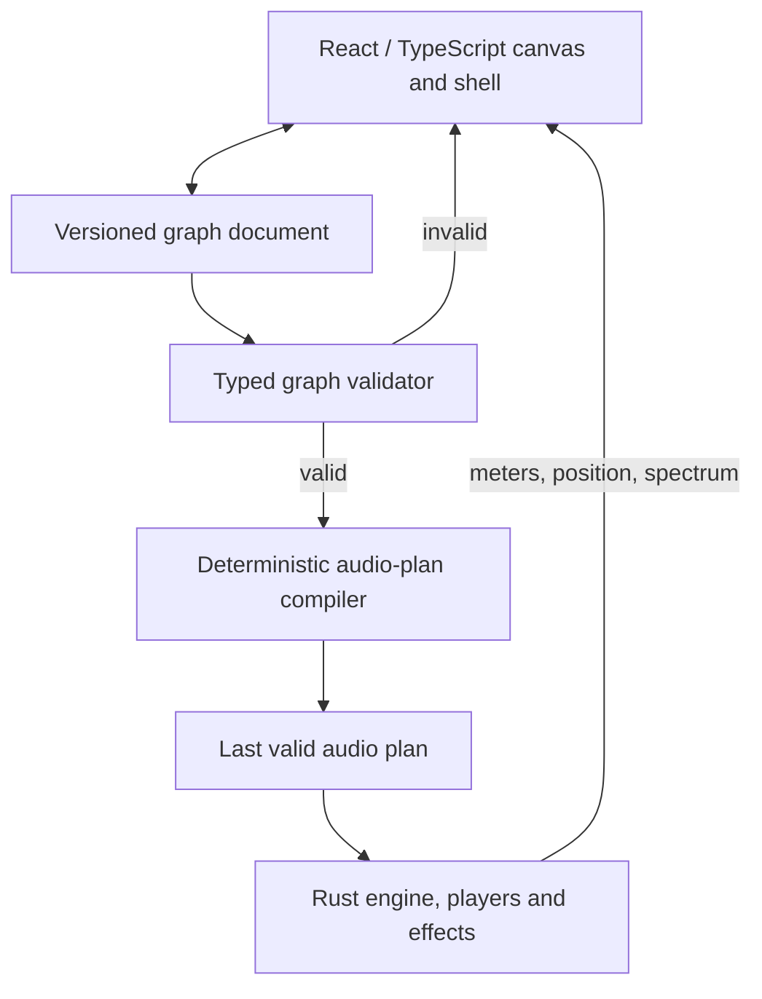
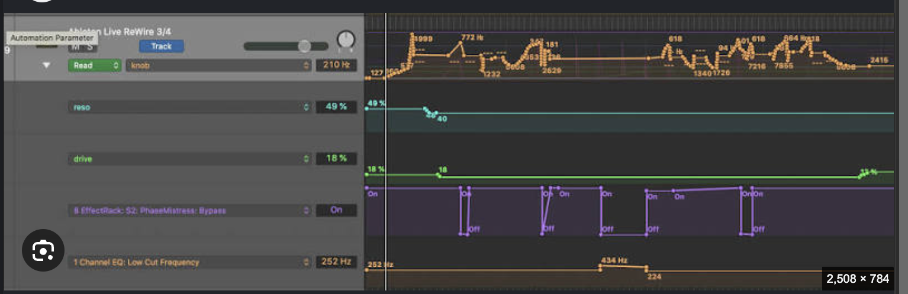
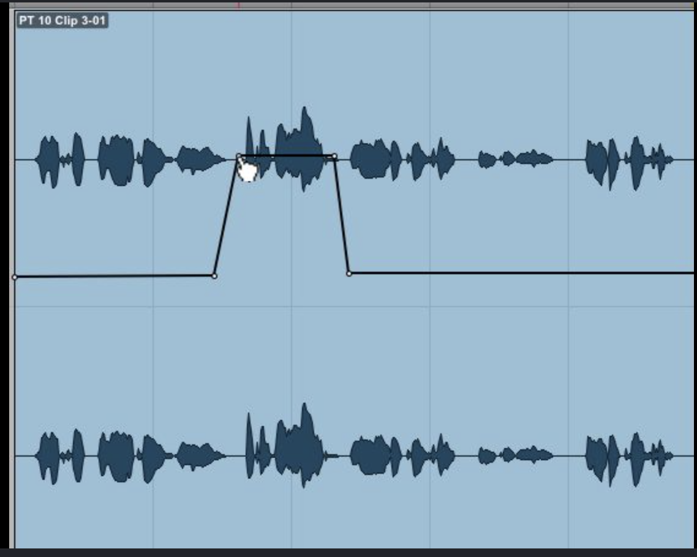
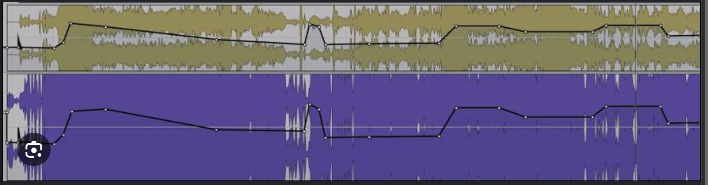
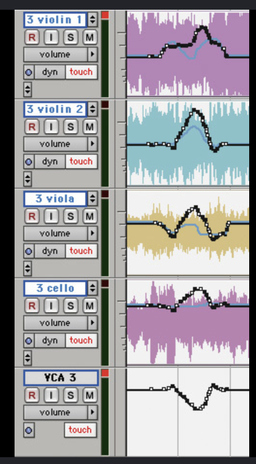

# Modular canvas, players and breakpoint automation

**Status:** approved architectural direction; implementation is staged on
`codex/breakpoint-automation`. The current editor and post-granulator rack remain
the working application until each replacement slice passes its tests.

**First foundation slice implemented:** `ui-next/` now contains tested versioned
graph primitives, scalable granular-player and four-channel sequencer-bank nodes,
stable parameter targets, typed port validation, strict appearance/audio-state
separation and complete semantic light/dark/high-contrast theme tokens. It is not
yet served by the Rust application; `ui/` remains the production interface.

This document records the product decisions made on 12 August 2026. It is the
target architecture for turning Audio Edit & Tag into a reusable, themed,
node-based sound application with multiple synchronized granular instruments,
patchable effects, MIDI control and looping breakpoint automation.

The existing application is documented in [ARCHITECTURE.md](ARCHITECTURE.md).
This plan does not claim that the canvas architecture is already built.

## Product definition

The new workspace is a **freeform application canvas**, not a left-to-right rack
or a conventional DAW arrangement. A project may contain several player nodes,
effects, mixers, utilities and automation modules anywhere in a larger space.
Users pan and zoom the space, patch typed ports, group related nodes and open a
focused editor only when a compact node cannot show enough detail.

The first audio topology remains deliberately simple: effects process audio
**after** granular playback. A pre-granulator effect path is not part of this
phase.

## Design inheritance and priorities

This application is not intended to look like one source project pasted into
another. Each owned application contributes the part it already does best:

| Application | Preserve | Direction |
|---|---|---|
| **Emovis** | Left tray, navigation behavior, side trays, interface interactions and theme engine | This becomes the application-wide interaction grammar and theming foundation. |
| **Audio Edit & Tag** | Look and feel, directness, reliability and the way Browse/Edit work without ceremony | This remains the visual character and usability standard for the combined application. |
| **idMLab** | Very large freeform canvas and context-sensitive menus in the right place | Reuse its spatial interaction and context-menu behavior rather than designing a new canvas. |
| **M-Clone** | A musical system that looks distinctive and already works, especially the four-channel MIDI sequencer | Preserve its behavior exactly while allowing its interface to be rendered with the modern idMLab component kit and shared theme tokens. |

The priority order for resolving a conflict is:

1. Preserve working musical and audio behavior.
2. Preserve the effortless Browse/Edit interaction standard.
3. Use the idMLab canvas interaction model.
4. Modernize presentation through the Emovis theme engine and idMLab interface
   elements without changing what a control does.

M-Clone is therefore a **functional source, not a visual fossil**. Its sequencer,
routing and performance semantics remain the same; its controls can adopt the
shared spacing, typography, focus, menu, panel and theme primitives so it looks
native inside the new application.

The initial validation target is four granular player nodes, one for each current
M channel. Four is a proven configuration, not an architectural ceiling. The
graph and document model contain no fixed player count; the system must scale to
8 or 16 players by adding sequencer banks/pages and negotiating a safe runtime
budget rather than changing project format.

## Views and application shell

The application uses the interaction model from the owned Emovis CTIO board:

- A persistent, resizable and collapsible left navigation rail.
- Distinct routed views rather than forcing every task onto one screen.
- One contextual right tray for detailed properties, presets, routing and help.
- Foldable navigation sections and persistent workspace preferences.
- A shared theming system and Theme Studio.

Its visual treatment remains grounded in Audio Edit & Tag. Emovis contributes
structure and interaction mechanics; it does not replace the application's
existing visual identity with the CTIO board's domain-specific styling.

Planned primary views:

| View | Purpose |
|---|---|
| **Browse** | Find, audition, classify and tag source files without processing. |
| **Edit** | Make non-destructive source edits and inspect the full waveform. |
| **Granular** | Focused single-player sound design using the existing detailed controls and visualizers. |
| **Canvas** | Build the multi-player instrument, patch effects and place automation modules. |
| **Theme Studio** | Preview, create, import, export and validate application themes. |

The permanent navigation must not become a second browser. The source-sound
browser used to load player nodes is a focused workflow whose final form remains
open: it may be a modal chooser, a temporary dedicated view, or a contextual
overlay. It must let a user locate and audition sounds, then assign one to a
specific player without disturbing other playing nodes. This is recorded as a
product decision still to be made, not silently assumed by the implementation.

The right tray is contextual. Selecting a player opens its complete granular
controls; selecting a Parametric EQ opens the existing large visual EQ; selecting
an automation lane opens breakpoint and mapping details. This prevents compact
nodes from becoming miniature versions of the entire current editor.

## Canvas interaction

The M-Clone/idMLab graph implementation is the starting point, including its
large virtual canvas, pointer-centered zoom, measured port positions, Bézier
cables, selection model and graph commands.

- The canvas is larger than the viewport and supports pan, zoom and fit-to-content.
- Nodes can be placed freely; signal flow is not forced left to right.
- Dragging a title bar moves a node without changing its audio state.
- Ports are typed. Invalid connections are rejected before they reach audio.
- Cable colors indicate signal type and remain readable in every theme.
- Multi-selection, duplicate, delete, align, group, undo and redo are graph commands.
- Node size and collapsed state are document data; transient selection is UI state.
- Visualizers are off by default on canvas nodes to protect rendering and audio
  performance. Focused views may enable them.

Topology changes compile into a new plan and crossfade safely. Ordinary control
movement updates parameters in place with smoothing; it must not rebuild the
graph or reset filter, delay, reverb or granular state.

## Node families

### Players

A granular player is a sound-producing node, not merely a waveform display.
Its compact face contains:

- File name, player color, enable, mute and solo.
- A reduced waveform with cue, selection, loop boundaries and playhead.
- Transport/trigger mode, loop count or continuous-loop state.
- Essential performance controls and input/output meters.
- MIDI activity and voice count.
- Audio output plus note, gate, pitch, clock and control inputs.

The focused player view retains the full Time & Pitch panels and optional grain
visualizers. Multiple players may sound concurrently. Each owns its voice pool,
source/edit state, granular configuration, post-player effect path and automation
bindings, while all may follow the same native transport clock.

The current player panel cannot simply be shrunk onto the canvas. It requires a
purpose-built modular redesign with two levels of detail:

- **Canvas face:** compact waveform, identity, transport state, essential
  performance controls, MIDI channel, voice activity, meters and patch ports.
- **Focused editor:** the complete granular engine, Time & Pitch controls,
  detailed waveform editing and optional visualizers using the established
  Audio Edit & Tag look and behavior.

The first player set is Player 1 through Player 4, corresponding by default to
M sequencer channels 1 through 4. The mapping is explicit and editable rather
than inferred from screen position. Additional players use the same node type;
there is no separate eight-player or sixteen-player implementation.

### Effects

Every existing rack effect becomes a patchable audio node. Controls remain live
while dragged and modules instantiate powered on. Nodes expose thin input and
output VU meters, which reset to zero when playback ends. The detailed editors
for Parametric EQ, Compressor, Dattorro Filter Bank and Chamberlin remain
available through the contextual tray.

Effects stay organized in the add-node library by function:

- EQ & dynamics
- Reverb & delay
- Chorus, flanging & phasing
- Filters & resonators
- Pitch & spectral
- Noise & modulation
- Utility & routing

Grouping is library metadata, not text repeated in each module title. Presets
and future automation address stable node and parameter IDs, so moving a node or
changing its screen position cannot disconnect control.

### Utility and routing

Utility combines gain, invert, channel swap, width and Amp Fit. Mixers, splitters,
mergers, sends/returns and outputs make fan-out and fan-in explicit. Feedback is
allowed only through a node that introduces a declared delay; an accidental
zero-delay cycle is rejected by validation.

## MIDI and instrument behavior

The owned M-Clone MIDI port and routing code will be adapted as a reusable input
package, while the native Rust engine remains responsible for sample-accurate
scheduling and sound generation.

The M-Clone four-channel sequencer is the first-class performance source. Its
existing musical behavior must be characterized by tests and preserved exactly
before its view is reskinned with shared idMLab/Emovis interface primitives.
Each sequencer channel can address one granular player by default, while graph
routing may later layer a channel across players or route several channels into
one instrument.

Scaling beyond four uses **banks of four channels** so the proven M interaction
remains intact. An 8-player project has two banks and a 16-player project has
four. Banks can be named, colored, reordered and shown together in an overview;
switching the focused bank must not interrupt the others. A channel-to-player
route is data, so bank number never becomes part of a player's identity.

### Scaling model

The saved graph is structurally unbounded, but realtime execution is constrained
by the selected device, buffer size, sample rate, effect topology and total
granular voices. Capacity is therefore expressed as a runtime budget, not a
hardcoded node maximum.

- **UI:** collapse/group nodes, zoom to selection, bank views and virtualize
  expensive offscreen visual content. Offscreen nodes continue sounding without
  continuously painting analyzers.
- **Sequencer:** retain four-channel interaction in reusable banks with an
  all-bank overview and clear activity indication.
- **Audio:** preallocate bounded voice pools, meter callback load/xruns and expose
  a project performance budget. Adding a player cannot allocate on the audio thread.
- **Graph:** compile only topology changes; moving nodes, changing banks or
  editing a smoothed parameter does not rebuild DSP.
- **Automation:** lanes address stable player/parameter IDs across every bank and
  are evaluated in blocks without one UI timer per lane.
- **Mixing:** use explicit submix/group nodes so 8–16 players remain navigable and
  gain staging remains visible.

Recommended experience tiers are 4, 8 and 16 players, but they are templates and
test matrices rather than file-format limits. The application reports measured
headroom and degrades visual refresh before it ever compromises audio continuity.

Initial messages:

- Note on/off, velocity and gate
- Pitch bend and channel pressure/aftertouch
- MIDI CC mapped to exposed parameters
- Channel filtering, omni mode and learn
- Sustain and all-notes-off safety
- Clock/start/stop/continue where an external clock is selected

A player supports mono, legato and polyphonic modes. Polyphony is a bounded
voice pool with deterministic voice stealing and click-safe attack/release.
Players can receive the same note stream for layered instruments or different
channels for independent performance. MIDI mappings use stable parameter IDs
and are saved with the project or reusable mapping preset.

## Shared time and synchronization

One native transport is the authority for sample position, tempo, meter and
loop phase. The UI displays that state but is never the clock. A node chooses a
clock relationship:

| Mode | Behavior |
|---|---|
| **Global** | Follows project transport and tempo. |
| **Player** | Follows the rendered/looped timeline of one player. |
| **Free** | Runs from its own phase while transport is active. |
| **Triggered** | Restarts from a MIDI note, gate or control event. |

Synchronization is expressed in samples internally. Musical units are a view
and editing layer over that sample clock, which keeps breakpoint playback and
render/export deterministic.

## Breakpoint automation as canvas modules

Automation is not a hidden subpanel inside an effect. A swim-lane automation
module lives on the canvas and patches a normalized or typed control signal to
one or more parameters. It may be collapsed to a compact node or expanded into
waveform-backed lanes.

The current automation subsystem already provides stable FX targets, step,
linear, smooth, exponential and Bézier curves, looping, trim, freehand writing,
simplification, copy/paste, modulators and Read/Touch/Latch/Write/Trim modes.
Those capabilities become the model layer for the canvas automation node.

An expanded module shows:

- The chosen sound waveform across the top.
- A ruler in clock time, samples, or bars/beats.
- Source-segment boundaries when a file repeats.
- One or more collapsible parameter lanes.
- Numbered and selectable breakpoints with exact time/value readouts.
- Loop region, playhead, snapping and curve type.
- A repeat count or continuous-loop choice for the sound segment.

Automation may extend across one play of the file or across repeated rendered
segments. Changing stretch recalculates the displayed output timeline without
changing the source edit list.

### Visual references

Multiple parameter lanes with distinct colors and direct value labels:

Waveform context behind a breakpoint envelope:

Stacked lanes sharing a clock and waveform context:

Several independently automated sound-producing tracks:

These images are interaction references, not instructions to reproduce another
application's chrome. The resulting interface follows this application's theme,
control language and graph model.

## Theming architecture

The theming system is a foundation layer shared by the application shell,
canvas, node faces, cables, ports, controls, meters, waveforms, visualizers,
automation lanes and detailed editors.

It combines two owned systems:

- **Emovis semantic tokens:** app backgrounds, surfaces, overlays, borders,
  typography, selection, focus, status, disabled state and navigation chrome.
- **M-Clone presentation tokens:** palettes, node-family accents, face kits,
  control kits, cable colors and custom-palette persistence.

The resolved style has three layers:

1. **Application theme** — global semantic colors, typography, spacing,
   elevation, motion and density.
2. **Node family accent** — player, effect, automation, MIDI, routing and output
   identities that remain consistent throughout the canvas.
3. **Optional node face kit** — a controlled visual variation that can change a
   node's face without changing layout contracts or DSP.

No DSP value may be derived from a visual token. Theme switching cannot alter
audio, routing, automation, presets or transport state.

### Theme Studio

Theme Studio provides:

- Built-in light, dark and high-contrast themes.
- Custom semantic palettes with live application and canvas preview.
- Family accent and signal-cable previews.
- Meter, waveform, analyzer and automation-lane preview states.
- Import/export, duplicate, rename and reset.
- WCAG-oriented text/controls contrast checks and color-blind-safe signal cues.
- Reduced-motion support and visible keyboard focus.

User theme preference persists separately from the audio project. A project may
optionally save appearance overrides, but importing a project does not silently
replace the user's application theme. Cables use color plus port shape/pattern,
so signal meaning never relies on color alone.

## Reuse map

All three source codebases are owned by the project author and may be reused
directly.

| Source | Reuse | Adaptation boundary |
|---|---|---|
| Current Audio Edit & Tag | Rust audio engine, edit model, effects, presets, automation model, waveform and analysis endpoints | Add graph-plan and multi-player ownership without duplicating DSP. |
| M-Clone | Four-channel MIDI sequencer, routing and proven musical behavior | Preserve behavior exactly; modernize its presentation with shared idMLab controls and themes. |
| idMLab branch of M-Clone | Graph types, commands, validation/compiler model, document migration, large viewport, port geometry, canvas node UI, contextual menus, audio-plan diff strategy, palettes/face kits | Connect the graph plan to the current Rust engine and redesign the granular player face. |
| Emovis CTIO board | Left tray, React/TypeScript app shell, routed views, right drawers, interaction patterns, preference stores, themes and Theme Studio | Apply its interaction and theme infrastructure while retaining Audio Edit & Tag's visual character. |

Primary M-Clone reference areas include `src/modular/model`,
`src/modular/compiler`, `src/modular/document`, `src/modular/audio`,
`src/modular/ui`, `src/modular/registry` and `src/modular/engine/midiinput.ts`.
Primary Emovis references are `prototype/ctio-pi-board/src/App.tsx`, its drawer
components, settings/theme stores and `UI_INTERACTION_TECHNICAL_SPEC.md`.

The target UI is React and TypeScript so these owned components and models can
be shared rather than translated into parallel vanilla-JavaScript versions. The
built frontend remains embedded and served by the native Rust binary for local,
offline operation.

## Document and preset model

The project document is versioned and migratable. At minimum it stores:

- Stable node, port, cable and parameter IDs.
- Node kind/version, position, size, collapsed state and optional appearance.
- Player source asset references, edits, loop behavior, voice configuration and
  granular parameters.
- Effect parameters, power state and presets.
- MIDI routes and learned mappings.
- Automation nodes, lanes, breakpoints, clocks, loops and target mappings.
- Transport tempo/meter and project-level synchronization.

Asset references use metadata and recoverable relinking rather than embedding
machine-specific absolute paths as the only identity. Unknown future nodes are
preserved as disabled placeholders instead of silently deleted.

Presets have explicit scopes:

- **Module preset:** one player, effect or automation node.
- **Chain preset:** a connected subgraph with parameters and mappings.
- **Instrument preset:** one or more players, MIDI routing and their post effects.
- **Project template:** graph, synchronization, theme appearance and layout;
  source assets may be intentionally empty.

Automation and preset serialization share the stable parameter registry planned
for later host-style automation. Every parameter declares its ID, unit, range,
scale, default, smoothing behavior and automatable/MIDI-mappable flags.

## Delivery plan and TDD gates

The work proceeds in vertical slices. Existing behavior remains usable between
slices.

1. **Extraction and contracts** — extract the owned Emovis shell/theme packages
   and M-Clone graph/MIDI packages; characterize them with tests before changes.
2. **Theme foundation** — semantic tokens, node accents, face kits, persistence
   and Theme Studio previews, with no raw component colors outside the token layer.
3. **Application shell** — routed views, left navigation and contextual right tray.
4. **Graph document** — typed nodes/ports/cables, commands, migration and unknown
   node preservation.
5. **Canvas UI** — pan/zoom, selection, patching, keyboard access and persistence.
6. **Native graph plan** — deterministic validation/compile, last-valid-plan and
   click-free topology crossfades.
7. **First playable slice** — one granular player, post-player effect and output
   node, with existing audio parity tests.
8. **M sequencer slice** — preserve the existing four-channel sequencer behavior,
   reskin it with shared interface primitives, and connect channel 1 to Player 1.
9. **Four synchronized players** — map all four M channels to four independently
   configured granular players on one shared sample clock, with deterministic
   live/offline parity.
10. **Banked scaling** — prove 8 and 16 player configurations using reusable
    four-channel sequencer banks, submixes, bounded voice pools and UI
    virtualization; establish measured performance budgets for supported hardware.
11. **Automation nodes** — waveform swim lanes, repeat expansion, breakpoint
    editing and sample-accurate playback.
12. **Migration** — convert the current document/rack/automation into graph data
    while preserving presets and stable IDs.
13. **Performance and release** — stress graph edits, many voices, dense automation,
    meters and theme changes while audio runs.

Each slice starts with failing tests. Required suites include:

- Pure graph validation, command inversion and schema migration tests.
- Graph compiler determinism, fan-out/fan-in, feedback and last-valid-plan tests.
- Audio click/discontinuity, parameter smoothing and live/offline parity tests.
- MIDI timing, voice stealing, stuck-note and synchronization tests.
- M-Clone sequencer characterization tests proving the themed version retains
  its original four-channel behavior.
- Parameterized 4/8/16-player load, bank-switching, submix and save/reopen tests,
  including audio-thread allocation and underrun instrumentation.
- Breakpoint interpolation, looping, repeated-segment and stretch-remap tests.
- Component interaction, keyboard, focus, zoom and drag tests.
- Theme switching, persistence, contrast, node override and migration tests.
- End-to-end save/reopen/relink and multi-player performance tests.

## Non-negotiable constraints

- Original source audio is never overwritten.
- The Rust audio thread performs no blocking I/O or unbounded allocation.
- UI rendering, meters and visualizers cannot be the transport clock.
- Parameter drags are realtime and smoothed; release is not required to hear them.
- Graph edits never expose a half-valid topology to the audio callback.
- Stable IDs survive reorder, visual movement, preset recall and document migration.
- Every audio/control port and parameter has a documented type and range.
- All new behavior is developed with TDD.
- The first graph release processes effects after players only.

## Definition of the first complete milestone

The first complete instrument milestone is reached when a user can open the
Canvas view, use all four M sequencer channels to play four independently
configured granular players, synchronize their loops, patch each through
post-player effects, automate exposed parameters with looping waveform-backed
breakpoint nodes, mix them to the native output, save/reopen the project, and
switch themes without a click, lost mapping, visual ambiguity or change in sound.

The following scalability milestone runs the identical project contract at 8
and 16 players through sequencer banks. Success means bank changes are seamless,
the canvas remains navigable, inactive visual detail is throttled, project files
need no schema variant, and overload is reported before it becomes audible.

## Open product decision: loading sounds

The browser for assigning source sounds to players remains intentionally TBD.
Candidate forms are:

1. A modal sound chooser launched from a player.
2. A dedicated temporary Browse view that returns the selection to the caller.
3. A contextual canvas overlay or right tray.

Whichever form is selected must retain fast search, folder navigation, raw-file
audition and the existing Browse look and feel. Audition must remain separate
from processed document playback, loading a sound must identify the destination
player, and choosing a file must not stop or reconfigure the other three players.
